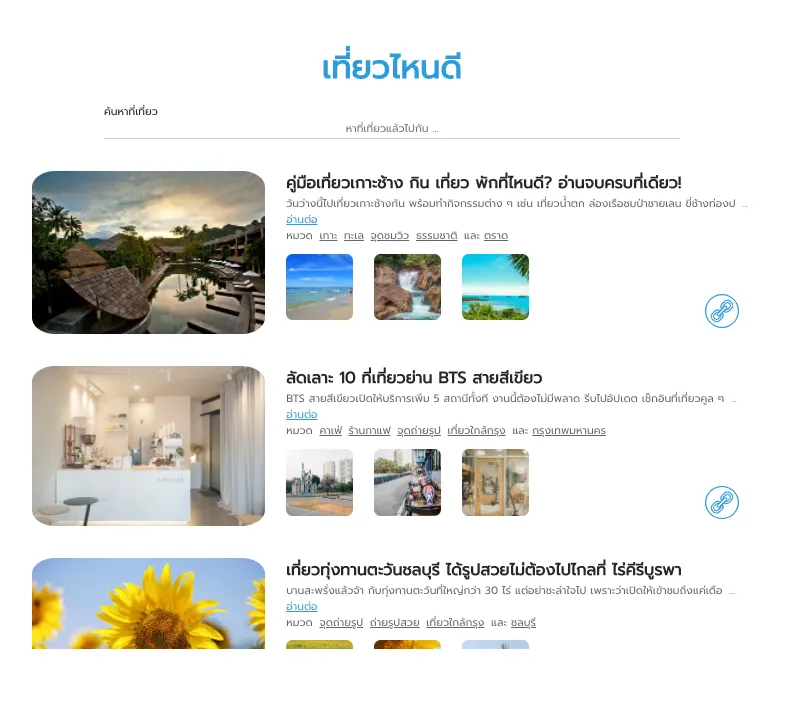

# 🌴 React Tourist Attraction Mini Project

> A React-based tourist attraction search application with interactive tag filtering and link sharing features.

[](https://reactjs.org/)
[](https://vitejs.dev/)
[](https://tailwindcss.com/)

---

## 📸 Preview



---

## ✨ Features

| Feature | Description |
|---------|-------------|
| 🔍 **Search** | ค้นหาสถานที่ท่องเที่ยวด้วย keyword |
| 🏷️ **Tag Click** | คลิก tag เพื่อเพิ่มคำค้นหา (ไม่ซ้ำ) |
| 🔗 **Copy Link** | คัดลอก URL ไปยัง clipboard |
| 📱 **Responsive** | รองรับทุกขนาดหน้าจอ |
| 🖼️ **Gallery** | แสดง main photo + 3 thumbnails |

---

## 🚀 Getting Started

### Prerequisites
- Node.js 16+
- npm or yarn

### Installation

```bash
# Clone repository
git clone https://github.com/your-username/react-tourist-attraction-mini-project.git

# Navigate to client folder
cd react-tourist-attraction-mini-project/client

# Install dependencies
npm install

# Start development server
npm run dev
```

### Start Backend Server

```bash
# In another terminal, navigate to server folder
cd react-tourist-attraction-mini-project/server

# Install dependencies
npm install

# Start server (runs on port 4001)
npm start
```

---

## 🏗️ Project Structure

```
client/src/
├── components/
│   ├── common/          # Reusable components
│   │   ├── Tag.jsx
│   │   └── CopyLinkButton.jsx
│   ├── layout/          # Layout components
│   │   └── Header.jsx
│   └── trip/            # Trip-related components
│       ├── TripCard.jsx
│       ├── TripGallery.jsx
│       └── TripList.jsx
├── hooks/
│   └── useTrips.js      # Custom hook for API
├── services/
│   └── tripService.js   # API client
├── utils/
│   └── clipboard.js     # Utility functions
└── App.jsx
```

---

## 🎯 Design Principles

| Principle | Implementation |
|-----------|----------------|
| **DRY** | Reusable components (Tag, CopyLinkButton) |
| **SRP** | Each component has single responsibility |
| **High Cohesion** | Files grouped by domain (trip, common, layout) |
| **Loose Coupling** | Props-based communication, no direct dependencies |

---

## 📦 Tech Stack

| Technology | Version | Purpose |
|------------|---------|---------|
| React | 18.2.0 | UI Library |
| Vite | 4.1.0 | Build Tool |
| TailwindCSS | 3.4.1 | Styling |
| Express | - | Backend API |

---

## 📝 API Reference

### Get Trips
```
GET http://localhost:4001/trips?keywords=<search>
```

**Response:**
```json
{
  "data": [
    {
      "eid": "1",
      "title": "Trip Title",
      "description": "...",
      "url": "https://...",
      "photos": ["url1", "url2", "url3", "url4"],
      "tags": ["tag1", "tag2"]
    }
  ]
}
```

---

## 🧪 Testing Checklist

- ✅ Display all trips on load
- ✅ Search functionality
- ✅ Title link opens in new tab
- ✅ "อ่านต่อ" link works
- ✅ Tag click appends to search
- ✅ No duplicate tags in search
- ✅ Copy link to clipboard

---

## 📄 License

This project is part of TechUp Frontend Skill Checkpoint.

---

**Made with ❤️ using React + Vite + TailwindCSS**
